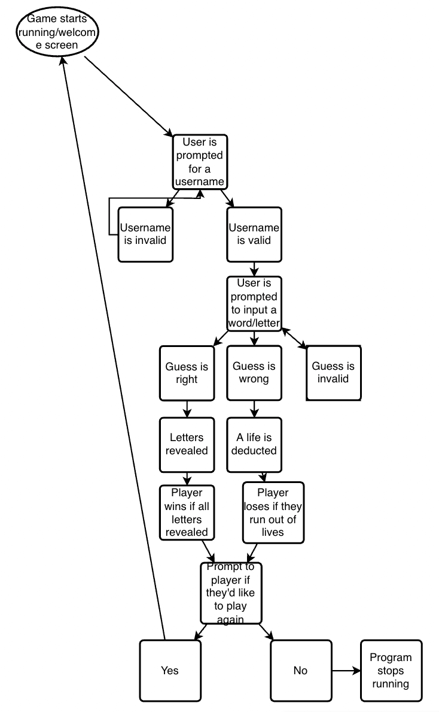
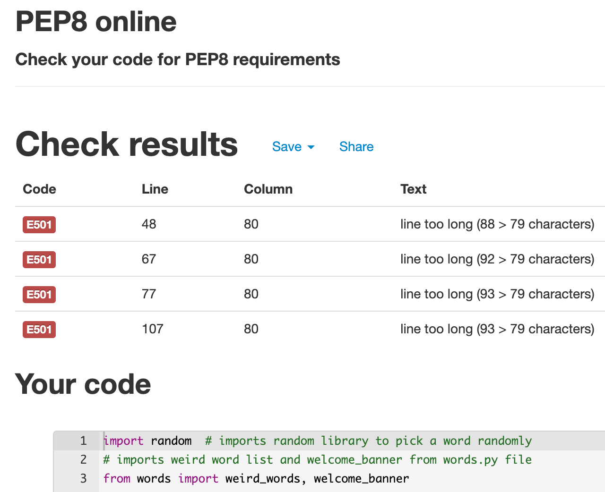
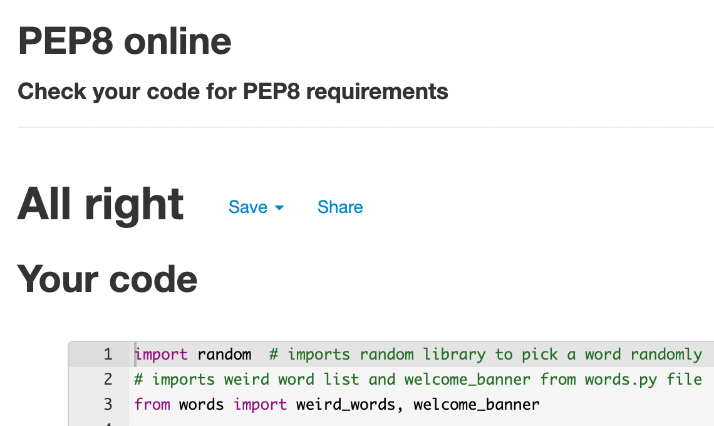
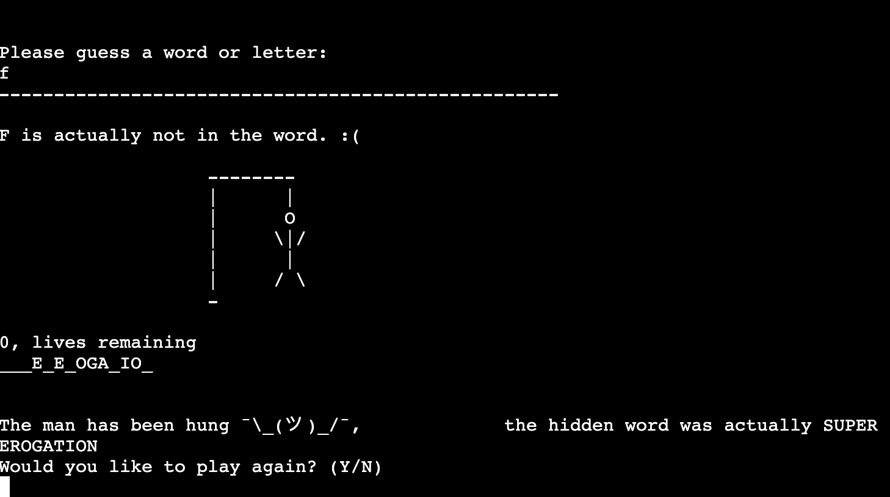

# WEIRD WORD HANGMAN

[Weird Word Hangman](https://github.com/richardreiter/hangman) is a Python terminal based word guessing game, which runs on Code Institute's mock terminal on Render (formerly on Heroku).

This game consists of a weird word that is hidden in a hang man style game. The player must guess a letter (or the whole word) in each round. 

The player has 6 lives, each wrong guess deducts a life from the player. If the player runs out of lives, they hang the man and the player loses.

The player wins the game if they correctly identify all the hidden letters!

Visit the live project [here.](https://weird-word-hangman.onrender.com/)

## UX (User Experience)

### Project Goals

- Showcase a simple classic fun game.
- Provide the user with instructions/rules on how to play the game.
- Provide feedback to the user on each round.

### Target Audience

- People of all ages.
- Anyone who wants to have a bit of fun with a guessing game.

### User Stories

- As a user, I want to understand what the game is about.
- As a user, I want to know how to play the game.
- As a user, I want to know the game's rules.

### Flowchart

- A flowchart was done to help visualise the project.

  

## Features

### Existing Features

- __Welcome Screen__

  - This is the first screen that the player sees, it welcomes the player with the game rules. 
  - At the end of the welcome message, it prompts the player to input their name.

- __Main Screen__

  - Greets the player with their chosen name.
  - Displays the image of the hanging man state.
  - Shows the amount of letters in the hidden word via underscores. Each underscore represents one letter.
  - Prompts the user to type the guess.

- __Correct Guess Screen__

  - If the player makes a correct letter guess, the letter is revealed
  - Feedback is provided to the user

- __Wrong Guess Screen__

  - If the player makes a wrong letter/word guess, a life is deducted from the player and feedback is provided.
  - The wrong letter can't be used by the player once again (meaning they won't lose another life if they try the same guess).

- __Invalid Guess Screen__

  - If the player attempts to input an invalid character (such as numbers or symbols), they will be thrown a message saying the guess was not valid.

- __Winning Game Screen__

  - If the player manages to guess the hidden word, they win the game!
  - The player is provided feedback and is prompted to play another round or not.

- __Losing Game Screen__

  - If the player runs out of lives/tries before guessing the hidden word, they lose the game.
  - The player is provided feedback and is prompted to play another round.

### Features Left to Implement

- High Score System
  - A high score system is a feature to keep in mind, so the player can compete with friends/family.
- Choose difficulty
  - An option to give the player to choose an easier/medium/harder difficulty of the game.

## Technologies Used

### Language Used

- [Python3](https://developer.mozilla.org/en-US/docs/Glossary/Python)

### Frameworks, Libraries & Programs Used

- [Git](https://git-scm.com/) & [Gitpod](https://gitpod.io/)
  - Git was used for version control via the Gitpod terminal in order to commit to Git and push to GitHub.
- [GitHub](https://github.com/)
  - GitHub was used for version control.
- [Heroku](https://heroku.com/)
  - Heroku was used originally for hosting and deploying the game.
- [Render](https://render.com/)
  - The project was then migrated from Heroku to Render.

## Testing

### Validator Testing

- [PEP8online](http://pep8online.com/)
  - At first, four "E501" warnings (line too long) were returned when passing through the PEP8online check.

  

- [PEP8online](http://pep8online.com/)
  - The warning messages were addressed when I broke 3 of the 4 lines (making them shorter) with a backslash (however that broke the code, so eventually "#noqa" was added to all the 4 lines - please refer to Fixed Bugs section below).
  - The remaining line was addressed with a "#noqa" comment. After implementing these fixes the linter validated the code with no issues.

  

### Device Testing

- The Weird Word Hangman was tested on the following devices/environments (without any issues):
  - MacBook Air 13.3" M1 (macOS Big Sur 11.6)
  - Lenovo 5i 15" i5 (Windows 10 64x)

### Browser Testing

- The Weird Word Hangman was tested on several browsers without any issues:
  - Google Chrome (Version 96.0.4664.55 (Official Build) (arm64))
  - Mozilla Firefox (94.0.2 (64-bit))
  - Safari (Version 15.0 (16612.1.29.41.4, 16612))
  - Brave (Version 1.32.113 Chromium: 96.0.4664.45 (Official Build) (arm64))
  - Vivaldi (4.3.2439.65 (Stable channel) (arm64))

### Fixed Bugs

- Long lines/spacing issue.
  - At first, 4 "E501" warnings (line too long) were returned when passing the code through the PEP8online check.
  - 1 of the 4 lines was addressed with a "#noqa" comment, after implementing these fixes the linter validated with no issues.
  - However, once the warning messages were addressed when I broke three of the four lines with a backslash, that caused a printing spacing issue:

  

  - The bug was finally fixed when I removed the backslashes and just added #noqa line comments to all 4 lines.
  
  

## Deployment

This project was deployed using Code Institute's mock terminal for Heroku:

- Steps for deployment:
  1. Fork or clone this repository.
  2. Create a new Heroku app.
  3. Add the Config Var: key = PORT and the value = 8000.
  4. Set the buildbacks to Python and NodeJS in that order.
  5. Link the Heroku app to the repository.
  6. Click on Deploy. 

## Credits 

- The website [tinypng.com](https://tinypng.com/) was used to compress the README images.
- The website [Visual Paradigm Online](https://online.visual-paradigm.com/) was used to create a flowchart.
- The list of random words was randomly generated thanks to [Random Word Generator.](https://randomwordgenerator.com/weird-word.php)
- The "Welcome" banner's ASCII Art was generated with the [ASCII Art Generator.](https://patorjk.com/software/taag/#p=display&f=Rectangles&t=Welcome)
- Many thanks to Anna Greaves for the [CI’s Love Sandwiches Walkthrough project](https://github.com/Code-Institute-Solutions/love-sandwiches-p5-sourcecode) for a great reference.
- Many thanks to [Sanjin Dedic](https://www.youtube.com/watch?v=3_CX0aD9Fdg) for a great inspiration, reference and example.
- Many thanks to [Kiteco](https://github.com/kiteco/python-youtube-code/tree/master/build-hangman-in-python)/[Kite](https://www.youtube.com/watch?v=m4nEnsavl6w) for a great inspiration, reference and example.
- [This Stack Overflow thread about "E501 line too long" PEP8 validation.](https://stackoverflow.blog/2021/07/05/best-practices-for-writing-code-comments/)
- [Code Institute](https://codeinstitute.net/) for the deployment terminal.

### Other

- Many thanks to CI's Tutor Support and CI's Slack community for their support.
- Many thanks to my mentor, Gerry McBride, for his guidance and feedback.
