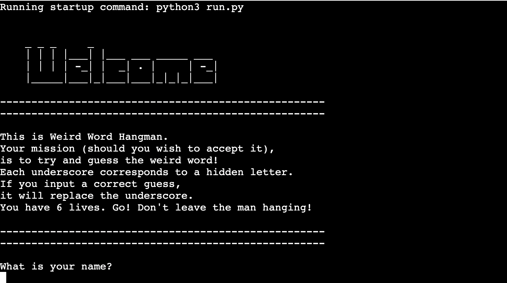
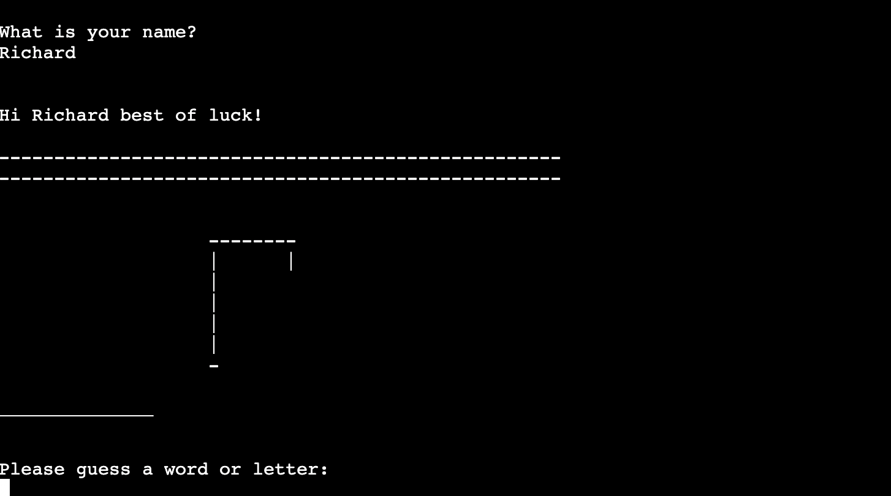
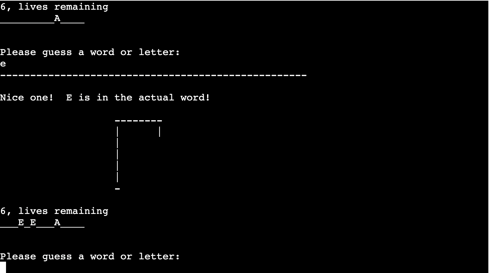
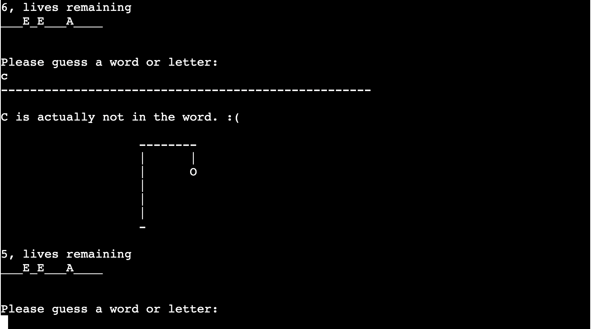
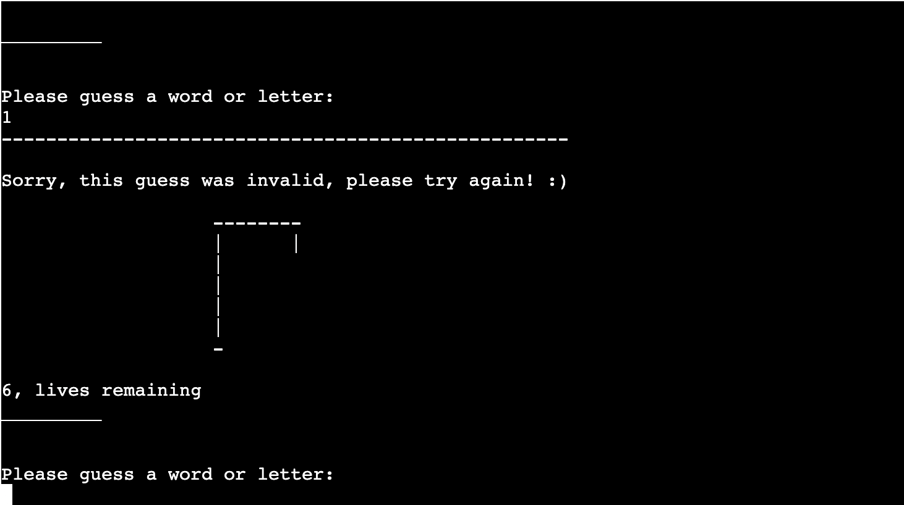
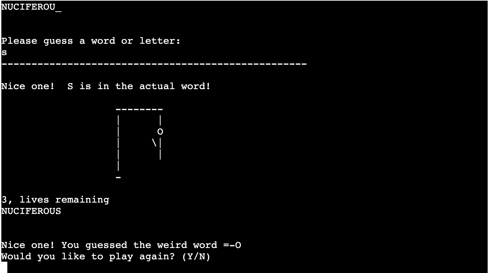
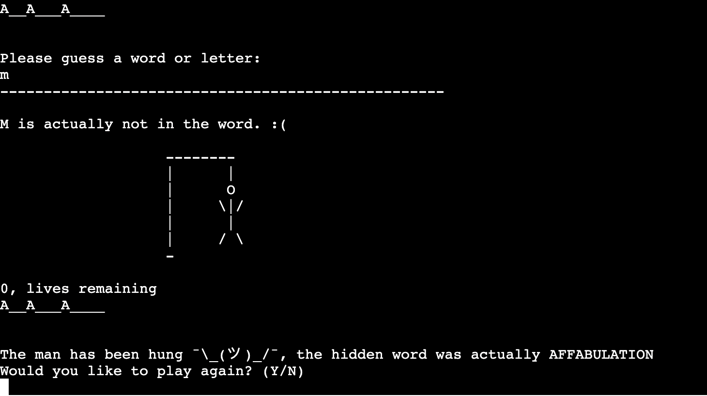

# WEIRD WORD HANGMAN

[Weird Word Hangman](https://github.com/richardreiter/hangman) is a Python terminal based word guessing game, which runs on Code Institute's mock terminal on Heroku.

There's a hidden weird word and the player needs to guess a letter (or the whole word) in each round.

The player has 6 lives, each wrong guess deducts a life from the player. If the player runs out of lives they hang the man and the player loses.

The player wins the game if they correctly identify all the hidden letters!

Visit the live project [here.](https://weird-word-hangman.herokuapp.com/)

## UX (User Experience)

### Project Goals

- Showcase a simple classic fun game.
- Provide the user with instructions/rules on how to play the game.
- Provide feedback to the user on each round.

### Target Audience

- People of all ages.
- Anyone who wants to have a bit of fun with a guessing game.

### User Stories

- As a user, I want to understand what the game is about.
- As a user, I want to know how to play the game.
- As a user, I want to know the game's rules.

## Features

### Existing Features

- __Welcome Screen__

  - This is the first screen the player sees, it welcomes the player with the game rules. 
  - At the end of the welcome message it prompts the player to input their name.

- __Main Screen__

  - Greets the player with their chosen name.
  - Displays the image of the hanging man state.
  - Shows the secret word via underscores.
  - Prompts the user to type the guess.

- __Correct Guess Screen__

  - If the player makes a correct letter guess, the letter is revealed
  - Feedback is provided to the user

- __Wrong Guess Screen__

  - If the player makes a wrong letter/word guess, a life is deducted from the player and feedback is provided.
  - The wrong letter can't be used by the player once again (meaning they won't lose another life if they try the same guess).

- __Invalid Guess Screen__

  - If the player attempts to input an invalid character (such as numbers or symbols), they will be thrown a message saying the guess was not valid.

- __Winning Game Screen__

  - If the player manages to guess the hidden word, they win the game!
  - The player is provided feedback and is prompted to play another round or not.

- __Losing Game Screen__

  - If the player runs out of lives/tries before guessing the hidden word, they lose the game.
  - The player is provided feedback and is prompted to play another round or not.

### Features Left to Implement

- High Score System
  - A high score system is a feature to keep in mind so the player can compete with friends/family.
- Choose difficulty
  - An option to give the player to choose an easier/medium/harder difficulty of the game.

## Testing

### Testing User Stories from User Experience (UX) Section

### Validator Testing

### Device Testing

### Browser Testing

### Features Testing

### Bugs

## Deployment

## Credits 

### Content

### Media

### Other